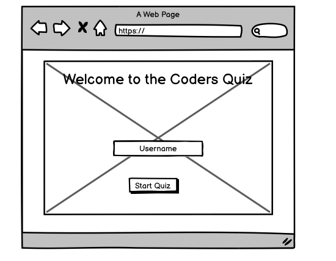
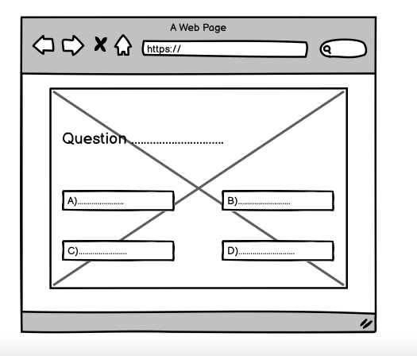
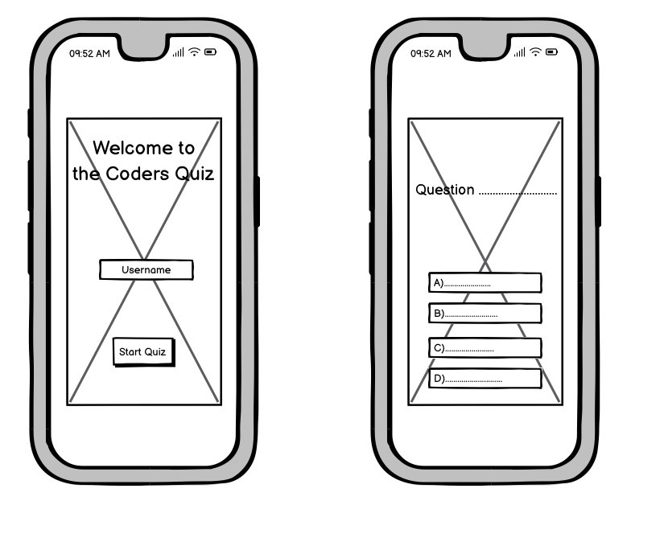
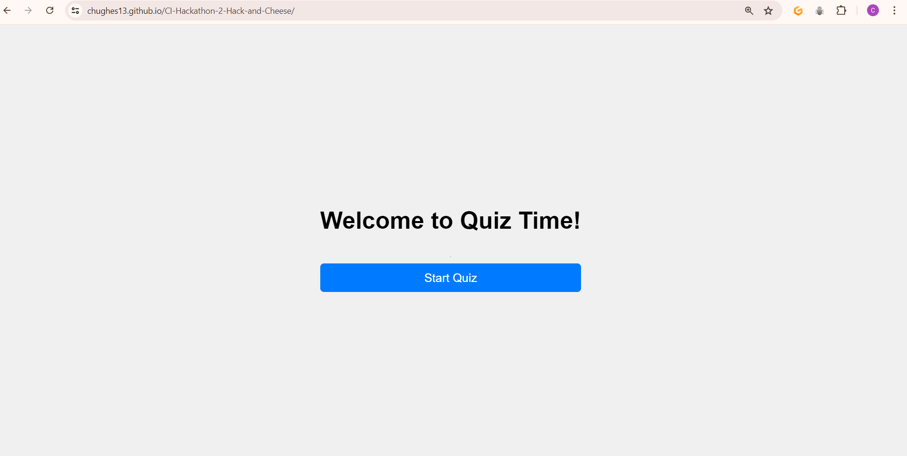
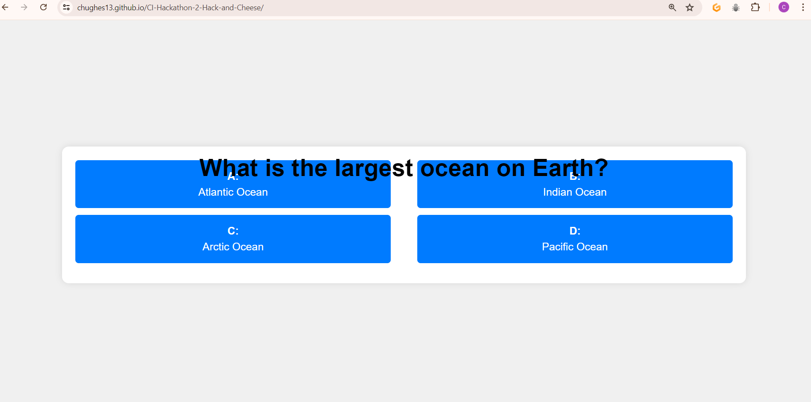
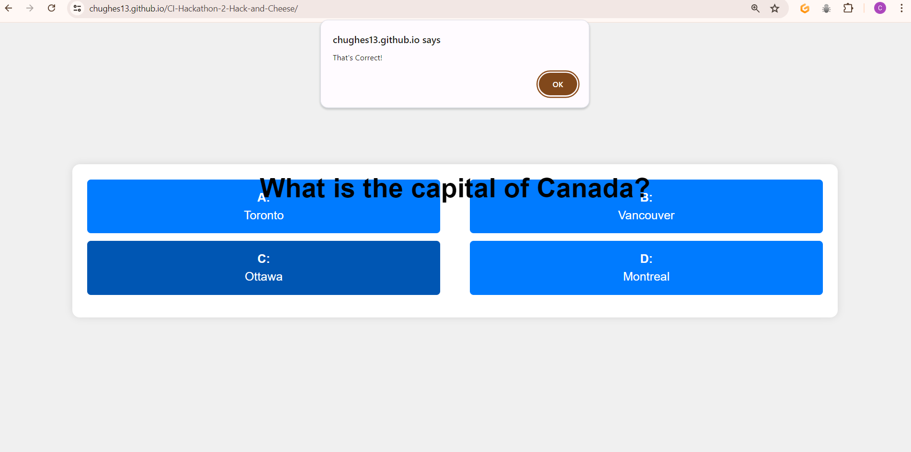
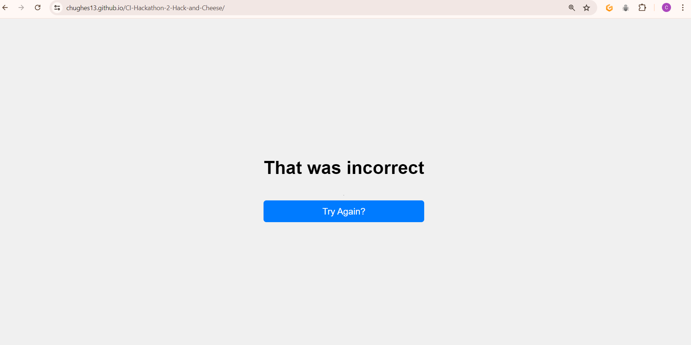
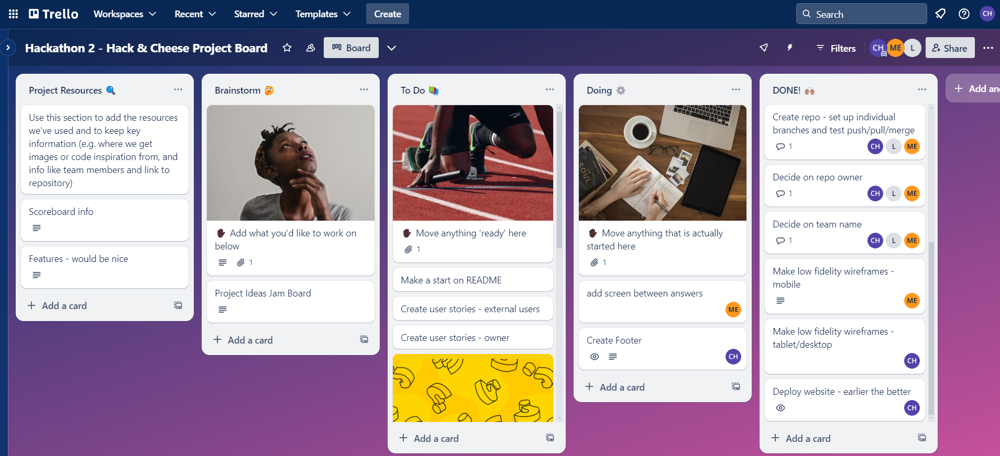

# Cheesy Choices!

## Overview

Cheesy Choices is a web-based trivia game that tests users on a wide range of subjects from geography to science. Users can enter their name, choose whether to play with a timer, and then proceed to answer multiple choice questions. The application keeps track of users' scores, correct and incorrect responses, and their best streak of correct answers.

## Wireframes

Here are the initial wireframes for the Cheesy Choices application, along with screen shots of the initial design. These provide a visual outline of the planned layout and functionality.

#### Welcome Screen

#### Question Screen
 

#### Mobile View

#

## Initial Design
These are screenshots of the project around the beginning of development:

-

-

-

## Technologies Used

- HTML5
- CSS3
- JavaScript
- Bootstrap 5.3.3
- [Jamboard](https://jamboard.google.com/d/1XjsnzAiuQ_O_WgiFDCjuUN0aw7v927GWzUWEdflyDuE/viewer?ts=667ec8a4&pli=1&f=1) (digital interactive whiteboard)
- [Trello](https://trello.com/b/CIy6Ngeo/hackathon-2-hack-cheese-project-board) (Project board)

## Features

### Existing Features
- __Username Input__
  - Allows user to enter their name. Gives the quiz a more personalised touch. Quiz will not start without a username – the user will be prompted via an alert to select a username.

- __Timer Option__
  - Offers the user the option play a timed quiz mode which will increase the quiz difficulty level. This can be toggled on/off at on the home screen.

- __Multiple Choice Answer Buttons__
  - When the user is presented with a question they are provided with four multiple choice buttons to choose from. When the user hovers their mouse cursor over the answer, the button changes to a lighter colour. When an answer is selected, it will either: turn green if it is correct, or it will turn red if it is incorrect and the button displaying the correct answer will turn green.

- __Home/Try Again Button__ 
  - This button will allow the user to easily navigate back to the home screen and replay the quiz.

- __Score Tracker__ 
  - This scoreboard keeps track of the users correct answers, incorrect answers, and their best streak (number of questions they have answered correctly in a row). Tracks and displays scores dynamically, with visual feedback on answers.

- __Responsive Design__ 
  - Responsive design for compatibility with various devices and screen sizes, from mobile to desktop.

- __Footer__ 
  - Footer section includes links to the relevant social media sites for Cheesy Choices. To allow for easy navigation, the links open in a new tab.
  - Copyright line includes year of publication and team name. This allows users to see how up to date the information on the web application is.
  - Features at the bottom of the page throughout (and has a matching colour theme with other elements on the site), this lets the user know they're still on the same webpage.
  - The footer is important as it encourages the user to interact and stay connected with Cheesy Choices on other social media platforms.

### Features Left to Implement
- __Difficulty Settings__ 
  - To give users the choice of quiz difficulty to make the quiz more fun and challenging (this would add replay value). To make the quiz easier, the user could start with 3 answers to choose from instead of 4. Introducing a 50/50 lifeline option that could be used once – this would grey out half of the answers, leaving 1 correct and 1 incorrect.

- __Get More Questions Using an API__ 
  - Currently the quiz has the questions hardcoded into it. To provide a wider variety of questions it would be good to find a suitable quiz/question API, such as [Open Trivia Database](https://opentdb.com/)

- __More Categories__ 
  - Currently the quiz is focused on general knowledge. Branching out to other specific categories adds more entertainment for the user. For example, a dedicated geography-based quiz or one focused on literature.

- __Image with Questions__ 
  - Adding an image underneath each question to create a more appealing and attention-grabbing. Image will relate to the question so the user will be able to easily identify what the theme is and what the question is about.

- __Image on Results Screen__ 
  - Adding an image on the Results Screen alongside the personalised message will add a more polished look.

- __High Score Table__ 
  - A table which would display the user's name and score. This would encourage the user to keep playing to gain a new personal best. The user could also challenge their friends and compete against them for the best high score.

## Manual Testing - TBA

### Validator Testing - TBA

- HTML
  - No errors were returned when passing through the official [W3C validator](TBA)
- CSS
  - No errors were found when passing through the [(Jigsaw) validator](TBA)
- JavaScript
  - No errors were found when passing through [JSHint](TBA)
- Website Optimization
  - No errors were found when passing through [Google Lighthouse](TBA)

### Unfixed Bugs - TBA

You will need to mention unfixed bugs and why they were not fixed. This section should include shortcomings of the frameworks or technologies used. Although time can be a big variable to consider, paucity of time and difficulty understanding implementation is not a valid reason to leave bugs unfixed. 

## Setup and Running the Application

1. Clone the repository to your local machine or download the HTML, CSS, and JavaScript files.
2. Open the HTML file in a web browser to start the application.
3. Enter your name, opt for a timed challenge if desired, and click 'Start Quiz' to begin.
4. Answer the questions by clicking on one of the choices.
5. View your score, correct answers, incorrect answers, and best streak at any time during the session.

## Credits - TBA

In this section you need to reference where you got your content, media and extra help from. It is common practice to use code from other repositories and tutorials, however, it is important to be very specific about these sources to avoid plagiarism.

